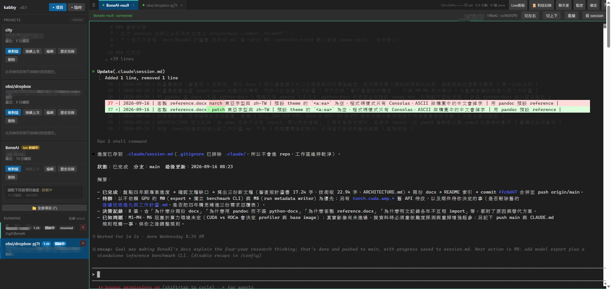
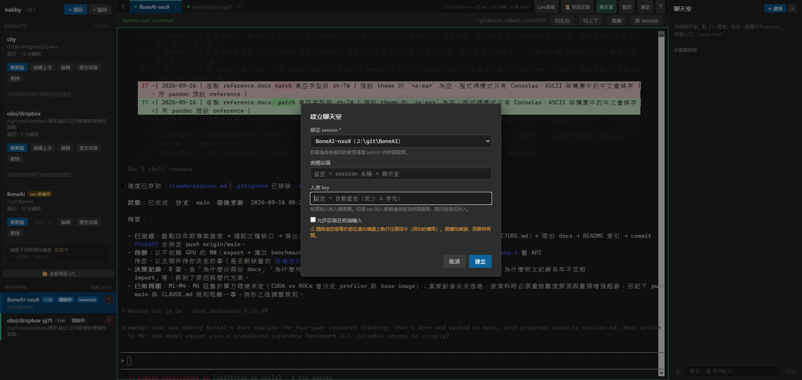
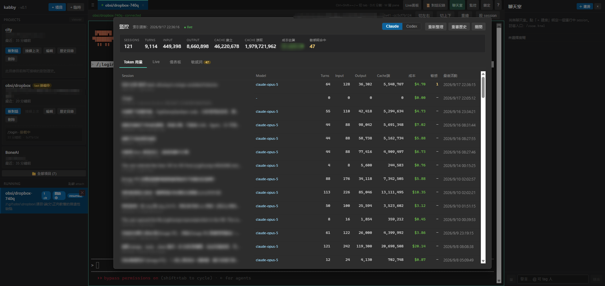

<div align="center">

# kabby

**一個 cc 進程，多個視窗同時 attach — 給 Claude Code 用的 PTY 多工器。**

桌面、瀏覽器、手機、iframe 看到的是同一個終端，關掉視窗 cc 照樣在跑。

</div>

---



<div align="center">

[English](./README.en.md) · **繁體中文** · [简体中文](./README.zh-CN.md)

</div>

## What is Kabby

一般在終端開 Claude Code，cc 的生命週期是綁在那個終端視窗上的：視窗關了、SSH 斷了，session 就沒了；想換一台裝置接手，只能重開一個新的 cc。

kabby 把 **cc 進程**跟 **client 連線**拆開。cc 跑在 daemon 裡的 PTY，任何 client（桌面 App、瀏覽器分頁、wepages 的 iframe、手機瀏覽器）用 WebSocket attach 上來，看到的是同一個畫面、同一份 scrollback，行為等同 `tmux attach`——只是 attach 的入口從終端變成了網址。

在這之上長出三個延伸功能：把 session 開成**聊天室**讓別人即時圍觀或協作、透過 tunnel **遠端**用手機接回家裡那台機器的 cc、以及掃 cc 歷史做 token 用量與成本的**分析監控**。

kabby 本身只有 Node.js + 四個依賴（express / ws / node-pty / cors），沒有資料庫，session 在記憶體，設定檔在 `~/.kabby/`。

## Installation

需要 **Node.js ≥ 18**，以及已安裝的 [Claude Code](https://docs.anthropic.com/en/docs/claude-code) CLI（Codex 亦可）。

```bash
git clone https://github.com/jokerjkeeper/kabby.git
cd kabby
npm install
npm start
# → kabby daemon listening on http://localhost:3700
```

開瀏覽器到 `http://localhost:3700` 就是完整 UI。`node-pty` 在 Windows 走預編譯的 ConPTY 後端，正常 `npm install` 即可，不需要 build 工具鏈。

開發時自動重啟：

```bash
npm run dev
```

**桌面 App（選用）** — Electron 殼，就是一個指向 daemon 的視窗：

```bash
cd desktop
npm install
npm start           # 開發
npm run dist        # 打包成 Windows portable exe
```

### Configuration

環境變數（可寫在 `.env`，範本見 `.env.example`）：

| 變數 | 預設 | 用途 |
|---|---|---|
| `PORT` | `3700` | HTTP + WS 共用 port |
| `HOST` | `127.0.0.1` | 監聽位址；設 `0.0.0.0` 開放區網直連（務必搭配 `AUTH_TOKEN`） |
| `AUTH_TOKEN` | （未設） | 設了之後 WS 連線必須帶 `?token=<value>` |
| `KABBY_VIEWER_PATH` | （未設） | cc history viewer 的 portable exe 絕對路徑；設了 UI 上「viewer」按鈕才會啟用 |

使用者資料放 `~/.kabby/`：`profiles.json`（項目清單）、`sensitive-words.json`（敏感詞庫）、用量索引。

## Features

### 多 client attach（本體）

- **一個 PTY、N 個 client**：新 client 接上先收 scrollback replay，再接即時輸出，不用重開 cc
- **項目（profile）**：把常用專案存成一張卡，一鍵「新對話」或「接續上次」——後者直接把 cc 的歷史 session 接回來
- **多 tab + 分割 pane**：`Ctrl+Shift+←/→` 切 tab、`Ctrl+Shift+D/E` 左右/上下分割，每個 pane 是一個獨立 session
- **Provider**：Claude Code 與 Codex 都能開，建 session 時選
- **敏感詞攔截**：送出的輸入在伺服器端比對詞庫，命中直接擋下不進 PTY

### Chat

主頁右上「聊天室」開右側面板：建立房間、綁定一個運行中 session、設一組入房 key。



別人開 `http://<host>:3700/room.html`（或用「複製連結」帶 `?key=`），輸入 key + 暱稱即可進房：

- **看終端**：即時看到綁定 session 的畫面（含 scrollback replay），跟隨房主的終端尺寸
- **文字聊天**：保留最近 200 則；支援**貼圖**（Ctrl+V 貼截圖或選檔，前端壓縮走 WS 存記憶體，每房保留最近 20 張）與 **@mention**（自動補齊房內成員，被 tag 會高亮提示）
- **權限**：房間有「可輸入」開關，**預設唯讀**，房主可隨時切換、即時生效；唯讀是伺服器端強制，不是前端隱藏
- **隔離**：訪客的 key 只換得該房綁定 session 的 WS + 聊天，打不到其他 API
- 房間存在記憶體，daemon 重啟或綁定 session 結束即自動關房

> ⚠ 開放「可輸入」等於讓訪客在這台機器上用你的權限執行任意指令，只給信任的人。

### Remote

daemon 綁 `127.0.0.1` 時只有本機看得到。要從外面接回這個 cc，兩種做法：

- **區網直連**：`HOST=0.0.0.0` + `AUTH_TOKEN`，同網段的手機/筆電直接連 `http://<內網 IP>:3700`
- **Cloudflare Tunnel（建議）**：kabby 維持綁 `127.0.0.1`，由 tunnel 對外暴露成 `https://kabby.你的網域`（對外 443、不開防火牆 inbound）。設定步驟見 [`docs/cloudflare-tunnel.html`](./docs/cloudflare-tunnel.html)

搭配 [`docs/deploy-systemd.md`](./docs/deploy-systemd.md) 把 daemon 設成 systemd service，達成開機自啟、崩潰重啟、不隨 SSH 斷線而停——等於一台永遠在線的 cc 主機，手機瀏覽器隨時接上去看它跑到哪。

另外 `embed.html` 是給第三方系統嵌入用的精簡終端頁，可用 iframe 掛進自己的工單/任務頁（見 [`docs/wepages-phase3-integration.md`](./docs/wepages-phase3-integration.md)）。

### Session Analyze

主頁右上「監控」開唯讀分析面板：背景 watcher 持續掃 Claude Code / Codex 的歷史 jsonl 建索引。



- 頂端總計：sessions、turns、input/output token、cache 建立與讀取、**成本估算**、敏感詞命中數
- **Token 用量**：逐 session 列 model / turns / token / 成本 / 最後活動，可展開看逐輪明細，抓得出哪一輪 context 爆掉
- **Live**：目前正在跑的 session 的即時逐輪用量
- **儀表板**：彙總視圖
- **敏感詞**：命中清單，詞庫在 `~/.kabby/sensitive-words.json`
- 右上切 **Claude / Codex**；「重新整理」重讀索引，「重審歷史」砍索引全掃（重算 token/成本並把目前詞庫套用到既有對話）

索引與定價表是本地計算，不會把你的對話送去任何地方。

## API

```bash
# 建 session
curl -X POST http://localhost:3700/api/sessions \
  -H "Content-Type: application/json" \
  -d '{"name":"unity","cwd":"D:/Projects/my-app"}'

# 列出所有 session
curl http://localhost:3700/api/sessions

# attach（任一 WS client，例如 wscat）
wscat -c ws://localhost:3700/ws/unity
```

完整 HTTP + WS 參考：[`docs/api.md`](./docs/api.md) · 從零開始的操作流程與排錯：[`docs/usage.md`](./docs/usage.md)

## Testing

```bash
node test/smoke.js
```

用 `cmd.exe` 代替 cc 跑（不依賴 claude 是否安裝），驗證：HTTP API 建立/刪除 session、兩個 WS client 同連一個 session 的 fan-out、第三個 client 後加入能收到 scrollback replay、`clientCount` 正確反映 attach 數。

## Architecture

```
client（桌面 App / 瀏覽器 / iframe / room.html）
        │  WebSocket  ws://host:3700/ws/<session>
        ▼
   daemon.js ── HTTP API + WS upgrade + fan-out
        │
   Session ── node-pty（一個 cc 進程）+ ring buffer（scrollback）
```

```
src/
  daemon.js        — Entry：HTTP server + WS upgrade + API routes
  session.js       — Session class：封裝 PTY + scrollback + clients
  registry.js      — 單例 Map<id, Session>，name 去重、ccSessionId 佔用查詢
  ring-buffer.js   — 100KB chunk-based ring buffer
  room-registry.js — 聊天室：房間、入房 key、成員與訊息
  profile-store.js — ~/.kabby/profiles.json CRUD
  usage-watcher.js — 背景掃歷史 jsonl 建用量索引
  cc-history.js    — 解析 cc 對話歷史 jsonl
  sensitive.js     — 敏感詞比對
public/            — Web UI（SPA + room.html + embed.html）
desktop/           — Electron 桌面 client
docs/              — API、使用手冊、部署（tunnel / systemd）
PLAN.md            — 設計決策與分階段規劃
```

設計決策與各階段細節見 [`PLAN.md`](./PLAN.md)。

## License

MIT
